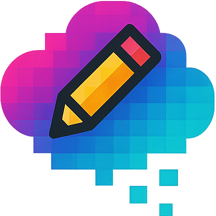

# Dream Pixel - Pixel Art Animation Studio

A modern, feature-rich pixel art creation and animation tool built with React and Vite. Create stunning pixel art animations with an intuitive interface, powerful drawing tools, and comprehensive animation features.



## ✨ Features

### 🎨 Drawing Tools
- **Pencil Tool** - Draw pixel by pixel with smooth interpolation
- **Eraser Tool** - Remove pixels with precision
- **Fill Tool** - Flood fill connected areas
- **Eyedropper Tool** - Pick colors from the canvas
- **Line Tool** - Draw straight lines with perfect shape options
- **Rectangle Tool** - Create rectangles and squares with fill/outline modes
- **Circle Tool** - Draw circles with center or corner positioning
- **Pan Tool** - Navigate around the canvas
- **Move Layer Content** - Shift entire layer content with mouse or arrow keys

### 🎭 Animation Features
- **Multi-frame Animation** - Create frame-by-frame animations
- **Timeline Management** - Add, delete, duplicate, and reorder frames
- **Onion Skinning** - See previous frame as reference while drawing
- **Frame Thumbnails** - Visual timeline with frame previews
- **Animation Preview** - Real-time playback with customizable FPS
- **Playback Controls** - Play, pause, step forward/backward
- **Playback Modes** - Loop and ping-pong animation modes
- **Frame Range Selection** - Play specific frame ranges

### 🏗️ Layer System
- **Multiple Layers** - Work with unlimited layers per frame
- **Layer Management** - Add, delete, duplicate, and reorder layers
- **Layer Visibility** - Show/hide individual layers
- **Layer Opacity** - Adjust transparency for each layer
- **Layer Renaming** - Customize layer names
- **Layer Groups** - Organize layers into groups
- **Layer Merging** - Combine multiple layers
- **Drag & Drop** - Reorder layers with intuitive drag and drop

### 🎨 Color Management
- **Dual Color Selection** - Primary and secondary color pickers
- **Color Palette** - Quick access to commonly used colors
- **Active Colors** - See all colors currently used in your project
- **Color Picker** - Full color picker with hex input
- **Color Snapping** - Automatic color quantization for pixel art

### ⚙️ Advanced Settings
- **Customizable Grid** - Adjustable grid size, color, and opacity
- **Canvas Settings** - Custom background colors and grid options
- **Tool Options** - Perfect shapes, fill modes, and drawing preferences
- **Export Settings** - Multiple export formats and scaling options
- **Performance Options** - Rendering quality and caching settings

### 📁 Import/Export
- **PNG Import** - Import single images or sprite sheets
- **Sprite Sheet Support** - Import multi-frame animations from sprite sheets
- **PNG Export** - Export single frames or complete sprite sheets
- **Custom Scaling** - Export at various resolutions (1x, 2x, 4x, 8x)
- **Frame Layout** - Customize sprite sheet layout with frames per row

### 🎮 User Experience
- **Keyboard Shortcuts** - Quick tool switching with hotkeys
- **Responsive Design** - Works on desktop and tablet devices
- **Dark Theme** - Modern dark interface with purple accents
- **Real-time Preview** - Live animation preview panel
- **Context Menus** - Right-click for quick actions
- **Tooltips** - Helpful tool descriptions and shortcuts

## 🚀 Getting Started

### Prerequisites
- Node.js (version 16 or higher)
- npm or yarn package manager

### Installation

1. **Clone the repository**
   ```bash
   git clone https://github.com/your-username/dream-mapper.git
   cd dream-mapper
   ```

2. **Install dependencies**
   ```bash
   npm install
   ```

3. **Start the development server**
   ```bash
   npm run dev
   ```

4. **Open your browser**
   Navigate to `http://localhost:5173` to start creating pixel art!

### Building for Production

```bash
npm run build
```

The built files will be in the `dist` directory, ready for deployment.

## 🎯 Usage Guide

### Basic Drawing
1. **Select a tool** from the toolbar (Pencil, Eraser, Fill, etc.)
2. **Choose colors** using the color picker (left click for primary, right click for secondary)
3. **Draw on the canvas** by clicking and dragging
4. **Use keyboard shortcuts** for quick tool switching (P, E, G, I, L, R, C, H, M)

### Creating Animations
1. **Add frames** using the + button in the timeline
2. **Draw on each frame** to create your animation sequence
3. **Use onion skinning** to see the previous frame while drawing
4. **Preview your animation** in the preview panel
5. **Adjust playback speed** with the FPS slider

### Working with Layers
1. **Add layers** using the + button in the layers panel
2. **Toggle visibility** with the eye icon
3. **Adjust opacity** using the slider in the context menu
4. **Reorder layers** by dragging them up or down
5. **Rename layers** by double-clicking on the layer name

### Exporting Your Work
1. **Click the export button** in the header
2. **Choose export mode** (Single Frame or Sprite Sheet)
3. **Select scaling** (1x, 2x, 4x, 8x)
4. **Configure sprite sheet** settings if needed
5. **Download** your pixel art as PNG

## ⌨️ Keyboard Shortcuts

| Key | Tool | Description |
|-----|------|-------------|
| `P` | Pencil | Draw pixel by pixel |
| `E` | Eraser | Remove pixels |
| `G` | Fill | Flood fill tool |
| `I` | Eyedropper | Pick colors |
| `L` | Line | Draw straight lines |
| `R` | Rectangle | Draw rectangles |
| `C` | Circle | Draw circles |
| `H` | Pan | Navigate canvas |
| `M` | Move Layer | Move layer content |
| `↑↓←→` | Move | Move layer content (when move tool active) |

## 🛠️ Technical Details

### Built With
- **React 19** - Modern React with hooks
- **Vite** - Fast build tool and dev server
- **Tailwind CSS** - Utility-first CSS framework
- **React Icons** - Icon library
- **PNGJS** - PNG image processing

### Architecture
- **Component-based** - Modular React components
- **Custom Hooks** - Reusable drawing and canvas logic
- **Canvas API** - High-performance pixel manipulation
- **State Management** - React hooks for state management

### File Structure
```
src/
├── components/          # React components
│   ├── Canvas.jsx      # Main drawing canvas
│   ├── Toolbar.jsx     # Drawing tools
│   ├── ColorPicker.jsx # Color selection
│   ├── LayersPanel.jsx # Layer management
│   ├── Timeline.jsx    # Animation timeline
│   ├── Preview.jsx     # Animation preview
│   └── ...
├── hooks/              # Custom React hooks
│   ├── useDrawing.js   # Drawing logic
│   ├── useCanvas.js    # Canvas rendering
│   └── ...
├── utils/              # Utility functions
│   ├── color.js        # Color utilities
│   └── importPng.js    # Image import/export
└── constants.js        # App constants
```

## 🎨 Tips for Pixel Art Creation

1. **Start Small** - Begin with 16x16 or 32x32 pixel canvases
2. **Use Limited Colors** - Stick to a cohesive color palette
3. **Plan Your Animation** - Sketch keyframes before adding details
4. **Use Onion Skinning** - Reference previous frames for smooth motion
5. **Export at Multiple Scales** - Test how your art looks at different sizes
6. **Organize Layers** - Use layers for different parts of your character/object

## 🤝 Contributing

We welcome contributions! Please feel free to submit a Pull Request. For major changes, please open an issue first to discuss what you would like to change.

### Development Setup
1. Fork the repository
2. Create a feature branch (`git checkout -b feature/amazing-feature`)
3. Commit your changes (`git commit -m 'Add amazing feature'`)
4. Push to the branch (`git push origin feature/amazing-feature`)
5. Open a Pull Request

## 📝 License

This project is licensed under the MIT License - see the [LICENSE](LICENSE) file for details.

## 🙏 Acknowledgments

- Inspired by classic pixel art tools like Aseprite and GraphicsGale
- Built with modern web technologies for accessibility and performance
- Special thanks to the React and Vite communities

## 📞 Support

If you encounter any issues or have questions:
- Open an issue on GitHub
- Check the existing issues for solutions
- Join our community discussions

---

**Happy Pixel Art Creating! 🎨✨**